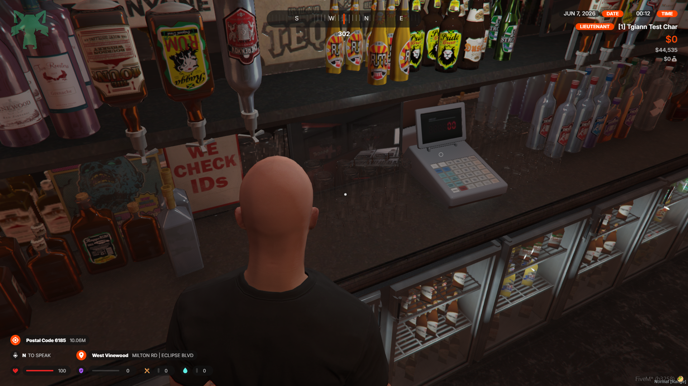
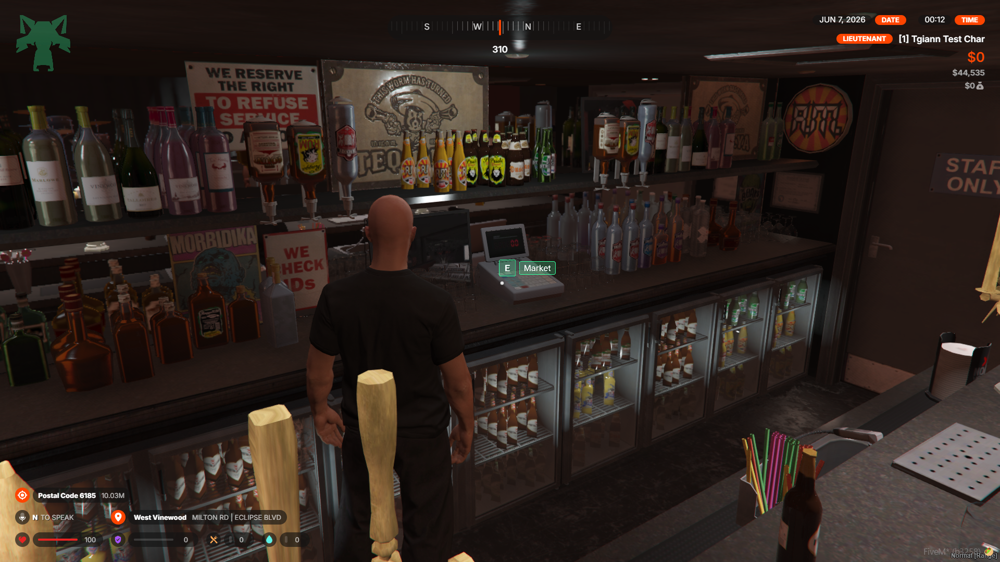
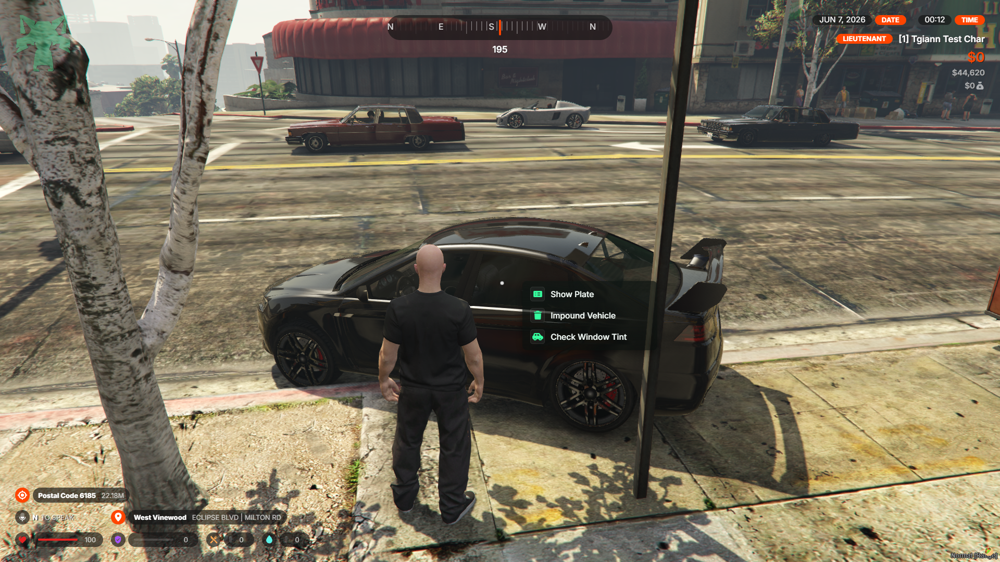

# tgiann-target

A performant, modern **third-eye targeting** resource for FiveM.

It is built on top of [ox_target](https://github.com/overextended/ox_target) and keeps the
exact same API, so anything written for ox_target works as-is — but the interaction model
and UI have been reworked, and it can also stand in for **qb-target** without touching your
other scripts.

## 📚 Documentation

https://docs.tgiann.com/tgiann-target

## 🖼️ Preview

| Ambient ring | Focused (hold E) | Menu |
| :---: | :---: | :---: |
|  |  |  |

## What's different from ox_target

The public API (`addBoxZone`, `addGlobalVehicle`, `addLocalEntity`, `canInteract`,
`onSelect`, `event`, `groups`, `items`, sub-menus, …) is **identical to ox_target**, so
existing code keeps working. The behaviour and presentation changed:

- **Always-on, look-based interaction** — no ALT to hold. Nearby targets show an ambient
  marker; look at one and it focuses into an **"E" prompt**, hold E to interact.
- **Modern, ARC-Raiders-style markers** — ambient rings drawn in-game; the focused prompt
  is rendered as a **DUI texture drawn in-game**, so its position updates with no per-frame
  NUI cost.
- **Reworked menu** — clean menu for multi-option targets and for global options, opened
  with **ALT** (global options live in this menu instead of cluttering the rings).
- **Hold-to-interact** with a border progress fill; single-option targets fire directly.
- **tgiann-core theme integration** — the accent colour syncs live with tgiann-core's
  colour, falling back to a default green when tgiann-core isn't present.
- **qb-target compatibility layer** built in (see below).
- **Convars** are read under both `tgiann-target:*` **and** `ox_target:*`.
- Cleaner, modular codebase (split utils, cached `canInteract`, throttled detection).

## ✅ Compatibility

It can replace **qb-target** or **ox_target** with **no changes to your other scripts** —
the resource registers its native API exports under its own name and `provide`s the target
resource you're replacing, so existing `exports.ox_target:...` / `exports['qb-target']:...`
calls resolve here.

## 📥 Installation

In every case: install [ox_lib](https://github.com/overextended/ox_lib) and start it
**before** tgiann-target.

```cfg
ensure ox_lib
ensure tgiann-target
```

### Normal install (new setup)

1. Download the latest `tgiann-target.zip` from releases and extract it into your
   `resources` folder.
2. Add `ensure tgiann-target` to your `server.cfg` (after `ox_lib`).
3. Use it from your scripts:

```lua
exports['tgiann-target']:addBoxZone({
    coords = vec3(0, 0, 0),
    size = vec3(2, 2, 2),
    options = {
        { name = 'example', icon = 'fa-solid fa-box', label = 'Interact', onSelect = function() end }
    }
})
```

### Replace ox_target (no script changes)

1. Stop / remove the original `ox_target` resource.
2. Keep the default `provide 'ox_target'` in `fxmanifest.lua` (it's already set).
3. `ensure tgiann-target`.

All existing `exports.ox_target:...` calls now resolve to tgiann-target — nothing else to
change.

### Replace qb-target (no script changes)

1. In `fxmanifest.lua`, change the provide line to:

   ```lua
   provide 'qb-target'
   ```
2. Stop / remove the original `qb-target` resource.
3. `ensure tgiann-target`.

Existing `exports['qb-target']:...` calls (AddBoxZone, AddTargetEntity, AddGlobalVehicle,
SpawnPed, …) are translated to the tgiann-target API by the built-in compatibility layer.

### Replace both ox_target and qb-target at once

List both provide lines in `fxmanifest.lua`:

```lua
provide 'ox_target'
provide 'qb-target'
```

Then remove both original resources and `ensure tgiann-target`.

## ⚙️ Convars

Set them under your resource name **or** `ox_target:` (both work):

```cfg
setr tgiann-target:holdDuration 600     # ms to hold E
setr tgiann-target:interactKey 38       # interact control (38 = E)
setr tgiann-target:maxDistance 10.0     # max marker distance (m)
setr tgiann-target:focusRadius 0.1      # reticle focus radius for zones
setr tgiann-target:duiScale 0.07        # on-screen size of the E prompt
setr tgiann-target:ringSize 0.025       # on-screen size of the ambient ring
setr tgiann-target:themeColor "#36ff9f" # accent colour
setr tgiann-target:debug 1              # enable debug zones/ped
```
